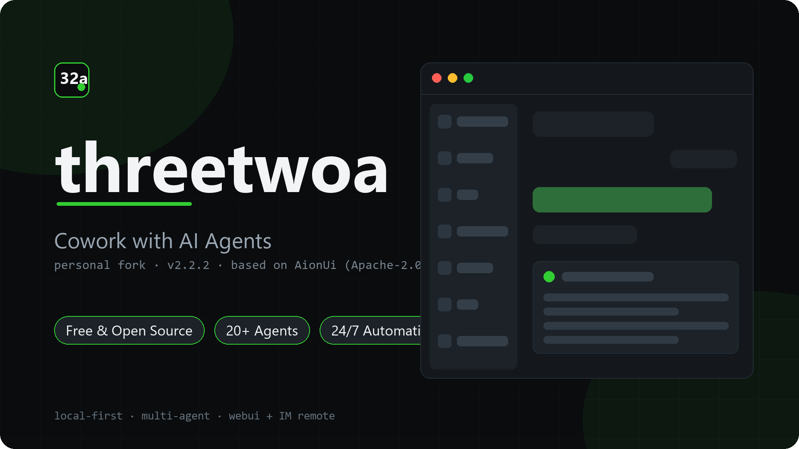
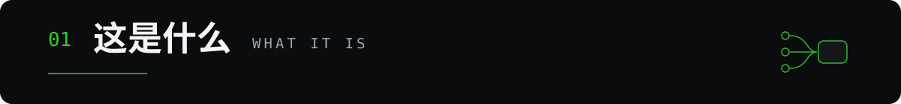
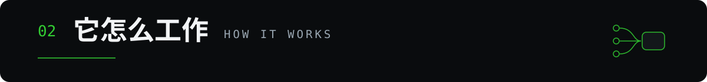
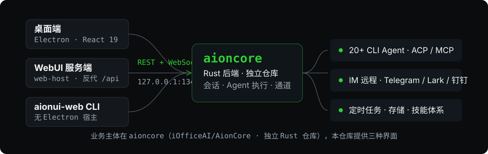
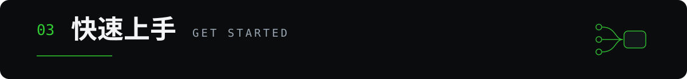
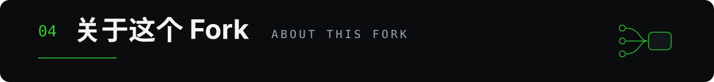

<p align="center">
  
</p>

<p align="center">
  <a href="https://github.com/iOfficeAI/AionUi"></a>
  &nbsp;
  <a href="https://github.com/iOfficeAI/AionUi/releases"></a>
  &nbsp;
  
  &nbsp;
  
  &nbsp;
  
</p>

<p align="center">
  <strong>给 20+ AI CLI Agent 的统一图形工作台</strong>——本地运行、多 Agent 并行、24/7 定时自动化、IM 远程接入。<br>
  <sub>本仓库是 <a href="https://github.com/iOfficeAI/AionUi">iOfficeAI/AionUi</a> 的个人二创 fork：承载自有改动、跟随上游演进。Windows 安装包见<a href="https://github.com/Aafff623/my-AionUi/releases">本仓库 Releases</a>，完整产品介绍见<a href="https://github.com/iOfficeAI/AionUi#readme">上游仓库</a>。</sub>
</p>

<p align="center">
  <a href="#what">这是什么</a> ·
  <a href="#architecture">它怎么工作</a> ·
  <a href="#start">快速上手</a> ·
  <a href="#fork">关于这个 Fork</a>
</p>

---

<a id="what"></a>

<p align="center">
  
</p>

**AionUi 不只是聊天客户端，而是一个 Cowork 平台**：AI Agent 在你的电脑上读文件、写代码、浏览网页、自动化执行任务——过程全部可见，权限始终在你手里。

|                | 传统 AI 聊天客户端 | **AionUi（Cowork）**                                                      |
| :------------- | :----------------- | :------------------------------------------------------------------------ |
| 操作本地文件   | 有限或不支持       | **内建 Agent 完整文件读写**                                               |
| 多步骤自主任务 | 有限               | **支持，按你的授权执行**                                                  |
| 手机远程接入   | 少见               | **WebUI + Telegram / Lark / 钉钉 / 微信**                                 |
| 定时自动化     | 不支持             | **Cron，24/7 无人值守**                                                   |
| 多 Agent 并行  | 不支持             | **20+ 外部 Agent 统一界面：Claude Code、Codex、Qwen Code、Gemini CLI 等** |
| 价格           | 免费 / 付费        | **免费开源**                                                              |

核心能力（均为上游既有功能）：

- **内建 Agent** — 装完即用，粘贴任意 API Key 就能跑；30+ 平台：Gemini、OpenAI、Anthropic、AWS Bedrock、Ollama / LM Studio 本地模型等
- **Multi-Agent 模式** — 自动检测已安装的 CLI Agent（Claude Code、Codex、Qwen Code、Gemini CLI、OpenClaw 等 20+），统一界面、并行会话、MCP 工具统一管理
- **Team 模式** — Leader 拆解任务，Teammate 经内置 Team MCP Server 并行执行；共享工作区、异步信箱、任务看板、独立权限确认
- **Office 助手** — 基于 OfficeCLI 的 PPT（Morph 动效）/ Word / Excel 生成，配 21 个内建专业助手
- **三层技能体系** — 内置技能 / 自定义技能 / 扩展技能（SDK），按会话粒度启停

---

<a id="architecture"></a>

<p align="center">
  
</p>

<p align="center">
  
</p>

AionUi 是**瘦客户端**：本仓库提供桌面 / WebUI / CLI 三种界面，业务主体跑在独立 Rust 后端 **aioncore**（[iOfficeAI/AionCore](https://github.com/iOfficeAI/AionCore)）里，经 REST + WebSocket（`127.0.0.1:13400`）通信。Agent 生态走 ACP（Agent Client Protocol）与 MCP（Model Context Protocol），MCP 工具在界面里统一管理。

- 改**界面与交互** → 在本仓库（主体在 `packages/desktop`）
- 改**会话、Agent 执行、IM 通道** → 在 AionCore 仓库
- 两边版本由根 `package.json` 的 `aioncoreVersion` 字段钉住

---

<a id="start"></a>

<p align="center">
  
</p>

**直接使用（推荐）**：

- **Windows**：到[本仓库 Releases](https://github.com/Aafff623/my-AionUi/releases) 下载安装包（`threetwoa-2.2.2-win-x64.exe`；未签名，首次安装时 SmartScreen 可能提示）
- **macOS / Linux**：本仓库暂未提供安装包，可到[上游 Releases](https://github.com/iOfficeAI/AionUi/releases) 下载，或 `brew install aionui`

**源码开发** — 前置：Node 22–24、Bun、Rust 工具链（aioncore 需本地构建）：

```bash
git clone https://github.com/Aafff623/my-AionUi.git
cd my-AionUi && bun install
# aioncore 后端：并排 clone iOfficeAI/AionCore，然后
# cargo install --path crates/aionui-app --locked
bun run dev                # 桌面端开发模式
bun run webui              # 无 Electron 的 WebUI 模式
```

完整开发文档见 [docs/contributing/development.md](docs/contributing/development.md)。

---

<a id="fork"></a>

<p align="center">
  
</p>

| 项       | 约定                                                                            |
| :------- | :------------------------------------------------------------------------------ |
| 远端     | `origin` = 本 fork（唯一 push 目标）；`upstream` = `iOfficeAI/AionUi`（同步源） |
| 基线     | v2.2.2（`6744099b`），跟随上游 main 演进                                        |
| 治理     | 项目事实见 [CONTEXT.md](CONTEXT.md)，决策记录见 [docs/adr/](docs/adr/)          |
| 边界     | 不改上游维护的 `AGENTS.md`、`.gitignore`、`.claude/`，fork 内容全部走新增文件   |
| 本地产物 | `temp/`（本地分析报告）、`.codegraph/`（代码索引）不入库                        |

## License

[Apache-2.0](LICENSE)，继承上游 [iOfficeAI/AionUi](https://github.com/iOfficeAI/AionUi)。上游多语言产品介绍存于 [docs/readme/](docs/readme/)。
